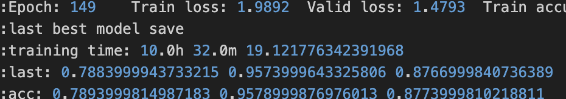
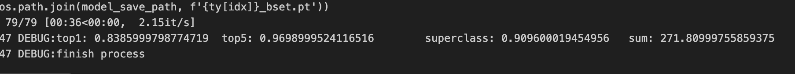

# 24-2 시각지능학습 코드 통합


# How to Conduct a Peer Review for This Project


## 1. Clone the repository

```shell
git clone https://github.com/hy-vision-learning/jck-vision-int.git
```

## 2. Move to jck-vision-init

```shell
cd ./jck-vision-init
```

## 3. Install Required Packages

All required packages can be installed via requirements.txt.
```shell
pip install -r requirements.txt
```

> [!NOTE]
> If an error related to package versions occurs during installation, remove the version information and try again.

## 4. Change the random seed

Open the [change_randomseed.py](./change_randomseed.py) file and change the random seed.

## 	5. Run the code

We are ensembling WideResNet, PyramidNet, and DenseNet. Therefore, a total of four runs are required.

Please train the models by running [ensemble-pyramidnet.ipynb](./ensemble-pyramidnet.ipynb), [ensemble-densenet.ipynb](./ensemble-densenet.ipynb), and [ensemble-wideresnet.ipynb](./ensemble-wideresnet.ipynb) one at a time. Once all the training is complete, run [ensemble-final.ipynb](./ensemble-final.ipynb) to output the final results.

> [!NOTE]
> 1.	Please run only one .ipynb file at a time.
> 2.	If you stop a running .ipynb file and need to retrain, restart the kernel before running it again.

## 6.	Check the Results

The training time for each model will be displayed immediately after the training is completed.  

  

  

The final training results will be output in the final file.  




## Final Results

|seed|time|score|
|:--:|:--:|:--:|
|4943872|48h 43m|272.049|

It is expected to take around 22 to 24 hours in practice.

## main.py 사용법

argument 출력
```shell
python3 main.py --help
```
출력
```
  -h, --help            show this help message and exit
  -t TEST, --test TEST  테스트모드
  -pm MODEL_PATH, --model_path MODEL_PATH
                        모델 폴더 이름
  --amp AMP             amp 옵션
  -rs RANDOM_SEED, --random_seed RANDOM_SEED
                        학습 랜덤 시드. -1은 랜덤 시드를 고정하지 않음.
  -lf LOG_FILE, --log_file LOG_FILE
                        로그 파일 출력 여부. 0=false, 1=true
  -po PORT, --port PORT
  -m {custom,resnet18,resnet34,resnet50,resnet101,resnet152,resnext50,wide_resnet_16_4,wide_resnet_28_10_03,densenet121,densenet169,densenet201,densenet161,pyramidnet100_84,pyramidnet200_240,pyramidnet236_220,pyramidnet272_200,pyramidnet_custom}, --model {custom,resnet18,resnet34,resnet50,resnet101,resnet152,resnext50,wide_resnet_16_4,wide_resnet_28_10_03,densenet121,densenet169,densenet201,densenet161,pyramidnet100_84,pyramidnet200_240,pyramidnet236_220,pyramidnet272_200,pyramidnet_custom}
                        학습 모델
  -p PARALLEL, --parallel PARALLEL
                        멀티 gpu 사용 여부. 0=false, 1=true
  -op {sgd,adam,sam}, --optimizer {sgd,adam,sam}
                        옵티마이저
  -ls {none,lambda_lr,step_lr,cos_annealing,custom_annealing,one_cycle,cycle,on_plateau}, --lr_scheduler {none,lambda_lr,step_lr,cos_annealing,custom_annealing,one_cycle,cycle,on_plateau}
                        lr 스케쥴러
  -ds SPLIT_RATIO, --split_ratio SPLIT_RATIO
                        train/validation 분할 비율
  -am AUGMENTATION_MODE, --augmentation_mode AUGMENTATION_MODE
                        data augmentation mode
  -asp AUGMENT_SPLIT, --augment_split AUGMENT_SPLIT
                        augmentation 분할 비율
  -w NUM_WORKER, --num_worker NUM_WORKER
                        train/validation 분할 비율
  -b BATCH_SIZE, --batch_size BATCH_SIZE
                        학습 배치사이즈
  -mc MIX_STEP, --mix_step MIX_STEP
                        mix 적용시 몇 step마다 적용할지. 0은 모든 step에 적용.
  -mt {none,mixup,cutmix}, --mix_method {none,mixup,cutmix}
                        mix 방법
  -pd P_DEPTH, --p_depth P_DEPTH
                        pyramnidnet depth
  -pa P_ALPHA, --p_alpha P_ALPHA
                        pyramnidnet alpha
  -ps P_SHAKE, --p_shake P_SHAKE
                        pyramnidnet shake
  -e EPOCH, --epoch EPOCH
                        epoch
  -mlr MAX_LEARNING_RATE, --max_learning_rate MAX_LEARNING_RATE
                        optimizer/scheduler max learning rate 설정 (custom cos scheduler는 반대)
  -milr MIN_LEARNING_RATE, --min_learning_rate MIN_LEARNING_RATE
                        optimizer/scheduler min learning rate 설정 (custom cos scheduler는 반대)
  -wd WEIGHT_DECAY, --weight_decay WEIGHT_DECAY
                        optimizer weight decay 설정
  -gc GRADIENT_CLIP, --gradient_clip GRADIENT_CLIP
                        gradient clip 설정. -1은 비활성화
  -lsm LABEL_SMOOTHING, --label_smoothing LABEL_SMOOTHING
                        label smoothing 설정
  -es EARLY_STOPPING, --early_stopping EARLY_STOPPING
                        ealry stoppin epoch 지정. -1은 비활성화
  -ad ADAPTIVE, --adaptive ADAPTIVE
                        adaptive SAM 사용 여부
  -snt NESTEROV, --nesterov NESTEROV
                        nesterov sgd 사용 여부
  --rho RHO             SAM rho 파라미터
  -cm COS_MAX, --cos_max COS_MAX
                        cos annealing 주기
  -cp CUT_P, --cut_p CUT_P
                        cutmix 적용 확률
  -sm STEP_MILESTONE [STEP_MILESTONE ...], --step_milestone STEP_MILESTONE [STEP_MILESTONE ...]
                        step lr scheduler milestone
```
